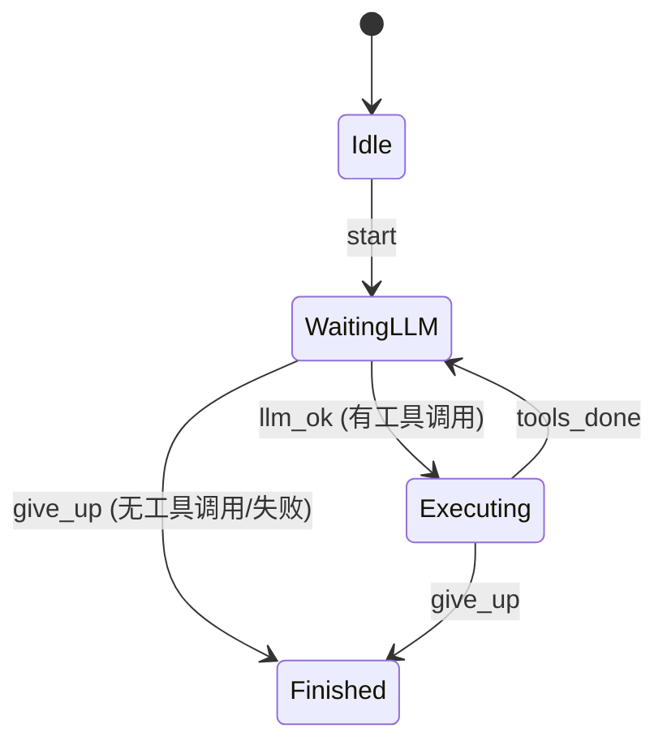

# core > src > agent > loop > AGENTS-CN.md

Agent 核心运行循环，基于 `boost::sml` 状态机驱动 LLM 交互和工具调用。

## 文件

| 文件 | 职责 |
|------|------|
| `loop.hh` | `AFS_Loop` 类声明 |
| `loop.cc` | 状态机定义、请求构建、响应解析、工具执行 |

## `AFS_Loop`

```cpp
std::string run(AFS_Agent& agent, AFS_Model& model);
```

运行完整循环，返回最终回复内容。

## 状态机



### 状态说明

| 状态 | 说明 |
|------|------|
| `Idle` | 初始状态 |
| `WaitingLLM` | 等待 LLM 响应 |
| `Executing` | 执行工具调用 |
| `Finished` | 结束 |

## 执行流程

参考 [Qwen Function Calling](https://help.aliyun.com/zh/model-studio/qwen-function-calling) 标准流程：

```
run(agent, model)
  │
  ├── 状态: WaitingLLM
  │     ├── 从 agent.context() 构建请求 JSON
  │     ├── 附加 tools 定义（含 name, description, parameters）
  │     ├── model.chatCompletion(request)
  │     ├── 解析响应 → 提取 content + tool_calls
  │     ├── context().addMessage(AssistantMessage + tool_calls)  ← 保留 tool_calls
  │     ├── 无工具调用 → 返回 content
  │     └── 有工具调用 → 状态 → Executing
  │
  ├── 状态: Executing
  │     ├── 遍历 tool_calls:
  │     │     ├── name → agent.toolRegistry().execute(call)
  │     │     └── 结果 → context().addMessage(ToolMessage + tool_call_id)  ← 匹配 id
  │     └── 状态 → WaitingLLM (循环，带工具结果再次请求)
  │
  └── 到达 kMaxIterations 或 Finished → 返回最后 Assistant 消息
```

## 请求格式

发送给 LLM 的请求 JSON：
```json
{
  "model": "deepseek-v4-pro",
  "messages": [
    {"role": "system", "content": "You are a helpful assistant."},
    {"role": "developer", "content": "You have access to tools..."},
    {"role": "user", "content": "What is 2+2?"}
  ]
}
```

## 工具调用响应格式

LLM 返回的 tool_calls：
```json
{
  "choices": [{
    "message": {
      "role": "assistant",
      "content": null,
      "tool_calls": [{
        "id": "call_123",
        "type": "function",
        "function": {
          "name": "compute",
          "arguments": "{\"op\":\"add\",\"a\":3,\"b\":5}"
        }
      }]
    }
  }]
}
```

工具执行后，ToolMessage 追加到上下文：
```
[Tool call_id=call_123] {"result": 8}
```

## 约束

- 最大迭代 10 次，防止无限循环。
- LLM 请求失败时返回空字符串。
- Agent 必须已通过 `createMain()` 初始化并完成工具注册。
