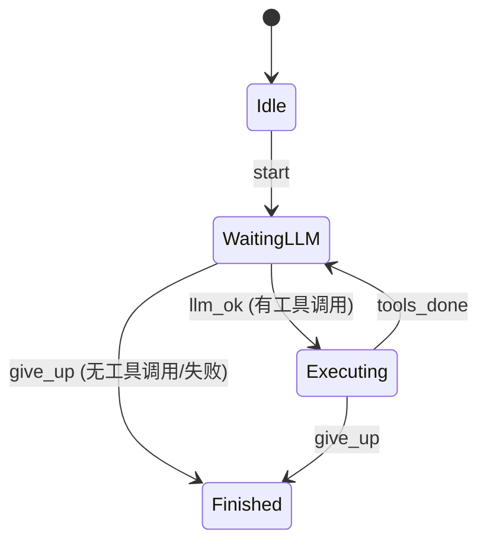

# core > src > agent > loop > AGENTS-CN.md

Agent 核心运行循环，基于 `boost::sml` 状态机驱动 LLM 交互和工具调用。
作为 `AFS_Agent` 的私有成员存在，通过 `friend` 声明访问 Agent 内部方法。

## 文件

| 文件 | 职责 |
|------|------|
| `loop.hh` | `AFS_Loop` 类声明（仅前向声明 AFS_Agent） |
| `loop.cc` | 状态机定义、响应解析、工具执行 |

## `AFS_Loop`

```cpp
std::string run(AFS_Context& context, AFS_ToolRegistry& tools,
                const AFS_Model& model, const std::string& agent_uuid);
```

运行完整循环，仅依赖四个精确资源，不依赖整个 Agent。
运行时事件通过 `AFS_Logger::publish*()` 写入缓冲区，前端 `poll()` 取出。

## 状态机



### 状态说明

| 状态 | 说明 |
|------|------|
| `Idle` | 初始状态 |
| `WaitingLLM` | 等待 LLM 响应 |
| `Executing` | 执行工具调用 |
| `Finished` | 结束 |

## 执行流程

Loop 内部持有 `buildRequest()`（静态函数），直接操作传入的 context/tools/model：

```
Agent::run()
  └── loop_.run(context_, tool_registry_, *model_, uuid_)
  │
  ├── 状态: WaitingLLM
  │     ├── buildRequest(context, model_name, tools) → 请求 JSON
  │     ├── 优先 model.chatCompletionStream(request) 接收 SSE chunk
  │     ├── 流式失败且未输出 delta → 回退 model.chatCompletion(request)
  │     ├── 解析响应/delta → 提取 reasoning + content + tool_calls
  │     ├── logger.publishReasoning*()  → TUI dim 思考段
  │     ├── logger.publishAssistant*()  → TUI 正文/流式正文
  │     ├── context.addMessage(AssistantMessage + reasoning + tool_calls)
  │     ├── 无工具调用 → 返回 content
  │     └── 有工具调用 → 状态 → Executing
  │
  ├── 状态: Executing
  │     ├── 遍历 tool_calls:
  │     │     ├── name → tools.execute(call)
  │     │     ├── logger.publishToolResult(msg.print())  → 缓冲区
  │     │     └── 结果 → context.addMessage(ToolMessage + tool_call_id)
  │     └── 状态 → WaitingLLM (循环，带工具结果再次请求)
  │
  └── 到达 kMaxIterations 或 Finished → 返回最后 Assistant 消息
```

## 职责边界

| 组件 | 职责 |
|------|------|
| `AFS_Agent` | 拥有 Loop、Context、Model；通过 `run()` 传递四个资源给 Loop |
| `AFS_Loop` | 纯状态机：WaitingLLM ↔ Executing，调度 LLM 调用和工具执行 |
| `AFS_Context` | 纯消息存储：累积对话历史 |
| `AFS_Model` | 纯 LLM 调用：`chatCompletionStream` / `chatCompletion` |

## 请求格式

发送给 LLM 的请求 JSON：
```json
{
  "model": "deepseek-v4-pro",
  "messages": [
    {"role": "system", "content": "You are a helpful assistant."},
    {"role": "developer", "content": "You have access to tools..."},
    {"role": "user", "content": "What is 2+2?"}
  ]
}
```

## 工具调用响应格式

LLM 返回的 tool_calls：
```json
{
  "choices": [{
    "message": {
      "role": "assistant",
      "content": null,
      "tool_calls": [{
        "id": "call_123",
        "type": "function",
        "function": {
          "name": "compute",
          "arguments": "{\"op\":\"add\",\"a\":3,\"b\":5}"
        }
      }]
    }
  }]
}
```


`reasoning_content` 是 DeepSeek thinking 模式的上下文字段。若 Assistant 历史消息包含该字段，`buildRequest()` 必须原样写回请求 JSON；否则后续带工具结果的请求会被 DeepSeek 拒绝。
工具执行后，ToolMessage 追加到上下文：
```
[Tool call_id=call_123] {"result": 8}
```

## 约束

- 最大迭代次数由 `AFS_Loop::kMaxIterations`（`loop.hh:18`）控制，默认 50 次，防止无限循环。修改此值即可调整 Agent 最大工具调用轮数。
- LLM 请求失败时返回空字符串。
- `AFS_Loop::run()` 仅接收四个精确资源，不依赖 `AFS_Agent` 类型。
- 运行时事件仅写入 `AFS_Logger` 缓冲区，不感知订阅者或消费方式。
- `buildRequest()` 是 `loop.cc` 内部的静态函数，直接操作 `Context`、`ToolRegistry`、模型名。
- Agent 必须已通过 `createMain()` 初始化、`setModel()` 设置模型、并完成工具注册。
